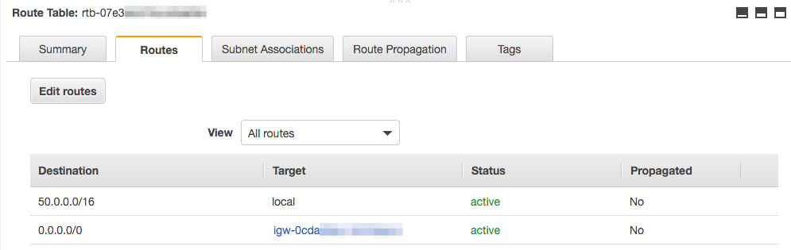

Auxiliary information
===

## Creating a VPC for networking

Your deployments in this workshop will need to be deployed in an AWS VPC
for networking purposes. To simplify things, we'll use a VPC that only has
**public** subnets.

> **Important:** In a production environment, it is always strongly recommended
> to design a network that minimizes your visible surface area.
> This means using private / internal subnets as much as possible, and 
> deploying resources in private subnets whenever possible.

If you're using a new AWS account, you should already have a default VPC in each
region that has been pre-configured with public subnets.
You can use this VPC for this workshop.

If you wish (or need) to create a VPC specifically for this workshop:

### Setting up a VPC

1. Go into your AWS Management Console, and navigate to the
   [VPC service console](https://console.aws.amazon.com/vpc).
2. Navigate to **Your VPCs** on the left navbar, and click the blue
   **Create VPC** button towards the top.
3. Set these options:
   1. **Name**: << your choice >> (`nickname-workshop-vpc` works great)
   2. **IPv4 CIDR block**: `50.0.0.0/16`
   3. Click the **Create** button at the bottom.
4. Click the VPC ID generated. **Remember this VPC ID --- we'll use it everywhere.**
5. Navigate to **Subnets** on the left navbar, then click the blue
   **Create subnet** button.
6. Set these options:
   1. **Name**: << your choice >> (`nickname-workshop-vpc-a` works great)
   2. **VPC**: << the VPC you just created >>
   3. **Availability Zone**: << choose one >> (you should see at least 3 options)
   4. **IPv4 CIDR block**: `50.0.0.0/24`
   5. Click the **Create** button at the bottom.
7. Create **two** more subnets in two other Availability Zones.
   1. CIDR Block `50.0.1.0/24`
   2. CIDR Block `50.0.2.0/24`

### Enabling public networking

The VPC you created is only for internal networking by default.
To allow external bi-directional networking (e.g. to the internet), we need
to incorporate an Internet Gateway appliance in the VPC.

1. Navigate to **Internet Gateways** in the left navbar, and click the blue
   **Create internet gateway** button at the top.
2. Give your IGW a name. (`nickname-workshop-igw` works great.)
3. Click **Create**.
4. Select the IGW you just created, then click `Actions > Attach to VPC`.
5. Select the VPC you created, then click **Attach**.

To allow your VPC resources to use the IGW you just created, 
we need to modify its route table to create a path to the IGW.

1. With your IGW selected, click the VPC it's assigned into to go back to its detail page.
2. With your VPC selected, click the **Route table** setting at the bottom of the page.
3. With your Route Table selected, select the **Routes** tab at the bottom.
   It should only show one route: `50.0.0.0/16 -> local`

> This route means that if any resource inside the network tries to communicate
> with an IP address within `50.0.0.0 ~ 50.0.255.255`, that the resource is 
> inside the VPC.
> 
> We need to add a new route so that anything **else** goes to the IGW,
> (since that resource will probably be external to the VPC).

4. Click **Edit routes**, then **Add route**.
5. Set the following options:
   1. **Destination**: `0.0.0.0/0`
   2. **Target**: `Internet Gateway -> << the IGW you created >>`
   3. Click **Save routes**.

Your completed route table configuration should look like the following:

---

## Setting up an AWS Cloud9 workspace

To accelerate setting up a development workspace
(or if you just want a separate environment for playing around),
you can set up an **AWS Cloud9** workspace.

1. Go into your AWS Management Console, and navigate to the 
   [Cloud9 service](https://console.aws.amazon.com/cloud9).