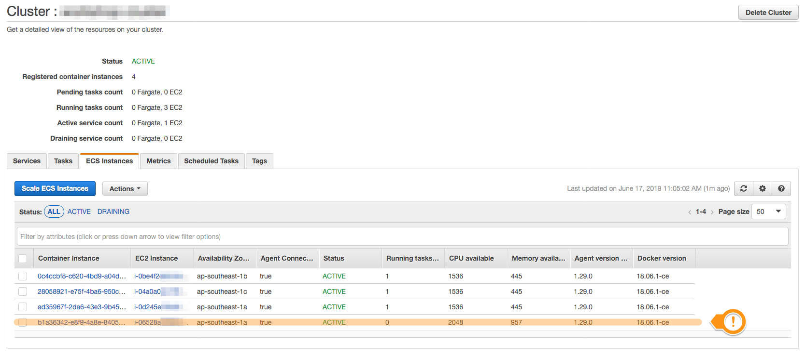
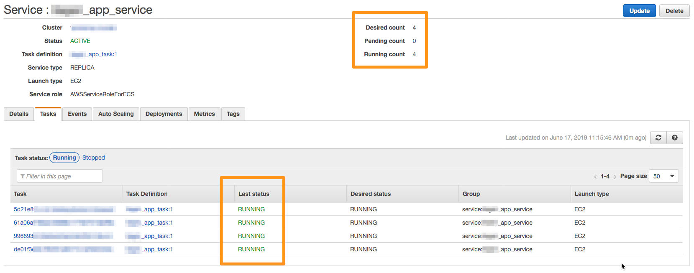
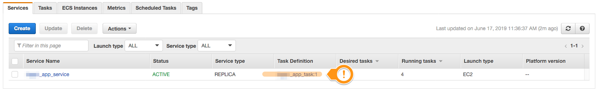
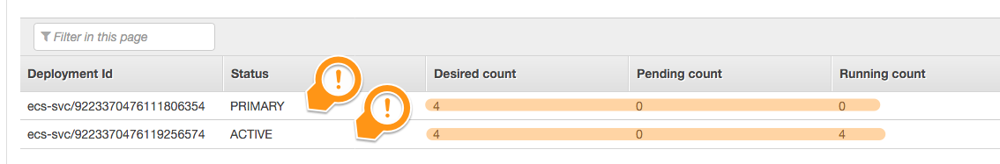
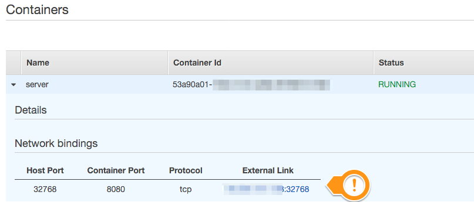

Module 03: Managing Tasks and Services in your Cluster
===

In a practical scenario, you'll have to make changes to how your application is
running. This can mean having to scale the number of tasks in your cluster,
or updating your service with new configuration. Or even updating the Docker
image used by your app.

In this module, we'll explore at how you can enact some of those changes
on your cluster.

---

## Implementation Details

### 1. Scale the number of tasks in your service.

In the previous module, we successfully launched a service in our cluster
that only ran a single instance of our task. Realistically, very often you'll
want to run more than just one task instance, or even want to change the number
as your application runs over time.

#### High-level instructions

Modify your service to run 3 instances of your task. (`1 -> 3`.)
Verify that the tasks are running correctly.

  
<strong>Step-by-step instructions (click to expand):</strong>

  

  
  1. Go back to your cluster's detail page, by clicking on your cluster 
     from your [Amazon ECS](https://console.aws.amazon.com/ecs) dashboard.

     Confirm that you're running only 1 service and 1 task in your cluster.
  2. On your cluster's **Services** tab, select your running service, 
     and click **Update**. 
  3. On the **Update Service** page, change:
     - **Number of tasks**: from `1` to `3`.
     - As we don't plan to change anything else, click **Skip to review**.
  4. Confirm the details of the update, then click **Update Service** to commit.
  5. At the confirmation page, click **View Service** to see the changes.
  

Your service will have been modified from maintaining only one instance of your
task to running 3 of them. 

If you go to your service's **Tasks** tab, you should see 3 instances running
(eventually) in `RUNNING` status. In your **Events** tab, you should see that 
your service has reached a steady state as well.

Test the tasks / containers just like how we did it in the previous module.

### 2. Scale the number of EC2 instances in our cluster.

In a container-based deployment, you don't only manage the number of tasks /
containers running, but also the number of hosts. Remember that tasks and containers
need to reserve resources for them to run --- those resources come from the
hosts that run the containers themselves. If there are not enough resources,
we'll have to adjust somehow --- this sometimes means we need to also scale
the number of hosts in our cluster.

#### High-level instructions

Scale your service again to run `4` copies of your task, and see how it reacts.
Investigate what goes wrong. 

Afterwards, increase the number of EC2 instances in your ECS cluster.
Verify that this now lets you launch more tasks.

  
<strong>Step-by-step instructions (click to expand):</strong>

  

  
  1. Update your service again, specifying that you want to run 4 task instances.
  2. Back in your service detail page, notice that while the **Desired count** has
     been updated to `4`, the number of running tasks maintains at `3`. 
  3. In the service's **Events** tab, review what happened.
  4. Navigate back to your cluster's detail page, and go to your 
     **ECS Instances** tab. You should see 3 EC2 instances.
  5. Click **Scale ECS Instances**, and change the **Desired number
     of instances** to `4`.
     > **NOTE:**
     >
     > If you were observant, you'd have noticed that your ECS cluster's 
     > EC2 instances are actually managed behind an 
     > [EC2 Autoscaling Group](https://aws.amazon.com/ec2/autoscaling/). 
     > This ASG should be visible from this modal.
     > 
     > When you update your cluster's desired number of instances,
     > you're actually updating the ASG's parameters to make this change happen.
     > 
     > You can also modify this ASG's parameters in other ways ---
     > for example, you can use scaling policies to automatically 
     > [change the number of EC2 instances required based on the amount of memory](https://docs.aws.amazon.com/AmazonECS/latest/developerguide/cloudwatch_alarm_autoscaling.html)
     > your tasks / containers are using.
  6. It will take a few moments for your new host to come online as the
     ASG attempts to create a new EC2 instance, start it, and register it against
     the ECS cluster.

     After a while, your cluster should now show 4 ECS instances.
     
  

After a while, your service would have recognized that there is now available 
resources, and it will have automatically launched the 4th task that it failed
to launch before.

### 3. Update our task and service

So, because of some investigation we did, we determined that the initial task
definition we created does **NOT** need 512 MB of memory. There's only one
container running inside it, and that only needs 256 MB. We're wasting the 
remaining 256 MB in the task!

Let's fix that!

> **NOTE:**
>
> It's not entirely correct to say that the remaining memory is being wasted.
> Since we configured the container to use a **soft limit** of 256 MB, it can
> be permitted to use _more_ than 256 MB if ever it needed to.

#### High-level instructions

Modify our task definition to only reserve 256 MB of memory, instead of the
initial 512 MB. Afterwards, modify the service running this task to use the 
newer version of the task definition instead.

  
<strong>Step-by-step instructions (click to expand):</strong>

  

  
  1. Go to your **Task Definitions** dashboard, and click your task definition.
  2. In your task definition detail page, you will have a list of revisions made
     made to it (there should only be one). Select the active revision, and
     click **Create new revision** at the top.
  3. Let's modify this task to use less memory. Modify the task memory from `512`
     to `256`. Notice how the single container allocated to this task now reserves
     100% of the reserved task memory.
     > **NOTE:**
     >
     > For reference, a `t3.micro` instance has **2 vCPUs, and 1 GB memory**.
     
     Click **Create** at the bottom to finalize your changes.
  4. Notice that you'll now have **two** revisions to your task definition.
     Now, we need to update our service to use the new revision, and not the 
     old one.
     > **IMPORTANT:**
     >
     > A running service will **not** automatically use new revisions to a 
     > task definition. This is to better ensure stability of an application.
     > The service will have to be updated to use the new revisions when
     > the new revisions have been tested thoroughly to work in a stable manner.

     Navigate back to your cluster's **Services** tab, and note that your service
     is still using the first revision of your task definition.

     
  5. Select your service, then click **Update**. under **Task Definition**, 
     specify that you want your service to use the revision you just created.
     (This should have been `Revision 2`.)

     Again, just **Skip to review**, and confirm your changes.
  6. You should be redirected to the service's **Deployment** detail tab.
     Notice that there are now 2 deployments currently in effect --- one is the
     old deployment (with 4 tasks running), and the other is a new deployment
     caused by your recent service configuration change.

     
  7. To allow the service to deploy the new task definitions, we need to 
     stop the tasks that are currently running to make room.

     > **🔥🔥🔥CHALLENGE:🔥🔥🔥** 
     > 
     > Why is that?

     Go to your **cluster**'s detail page, and navigate to the **Tasks** tab
     at the bottom. Note that all the tasks are still running your first revision.

     Select one of these tasks and stop it by clicking the **Stop** button.
     Confirm the action by clicking **Stop** in the modal that shows.

     The service will go down to 3 running tasks --- after a while, it will 
     go back to 4 tasks as the service tries to maintain the number of 
     running instances. Note that when a new task is started by the service, 
     it will now be using the new task definition revision.
  8. Proceed to stop the 3 remaining tasks that are using the old task definition.
     The service will come back up with 4 running tasks after a short period.
  9. To confirm that the new tasks are now using less memory, you can confirm
     the resource usage by going to your cluster's detail page, then 
     navigating to the **ECS Instances** tab, then checking the memory available.
  

### 4. Update our containers to use dynamic port mapping.

As it is, our task launches containers on our host, and binds the container's
`port 8080` to the host's `port 80`. This works really well, but has one very
important problem: we can't bind more than multiple apps to a single port.

This means that if we try to run more than one container in a single host,
we'll hit an error, because 2 containers can't both be bound to the same
host port `80`. 

To remedy this, we can specify our task to run containers using **dynamic
port mapping** --- Amazon ECS will run tasks, and then bind the specified
container port to a (somewhat) random free port on the host. This way, containers
don't try to race each other binding to a single host port.

#### High-level instructions

Update our task definition to have the container use dynamic port mapping, instead
of being specifically bound to the host's port `80`.

  
<strong>Step-by-step instructions (click to expand):</strong>

  

  
  1. Go into your task definition again, and create a new revision of your
     latest task definition revision.
  2. In the task definition configuration screen, click on the container definition
     in the task definition.
  3. Modify the **Port Mappings** section so that the **Host port** is set to `0`
     (instead of the old setting `80`). Click **Update**, then **Create** to 
     finalize the new revision.
  4. Update your service again, and point it to the newest revision for your
     task definition. Notice that it will start up new tasks almost instantly.
  

Since there are no conflicts with how your new service update needs to run with
how the old service is already running, Amazon ECS is able to run new containers
using the new definition alongside the old ones. 

After the new tasks are running in a stable manner, Amazon ECS will automatically
stop the old tasks --- but not before draining their connections according to your
configuration. Normally this just means that the new containers will not accept new
connections, and will have a pre-defined window of time to finish all the existing
processes it needs to finish (e.g. existing API calls). After this draining period,
containers are then killed.

If you then go to one of the tasks, you'll notice that their external URL is
not anymore bound to port `:80`, but a seemingly random one.

---

## Summary

We've barely scratched the surface of what you can do to manage your container
workloads, but we've discussed quite a bit --- enough for you to explore more 
on your own.

In the next module, we'll do a bit more exploring.