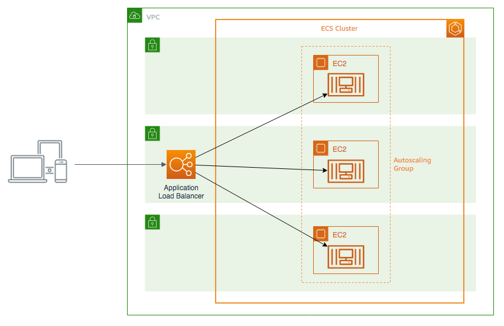
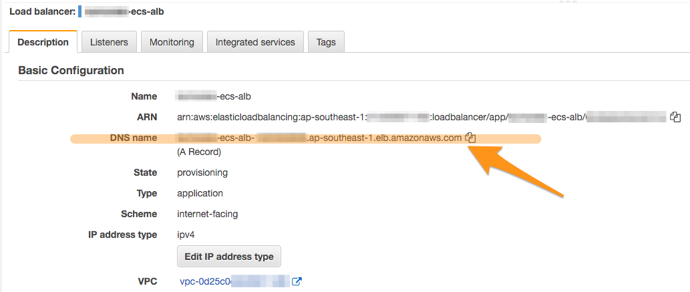
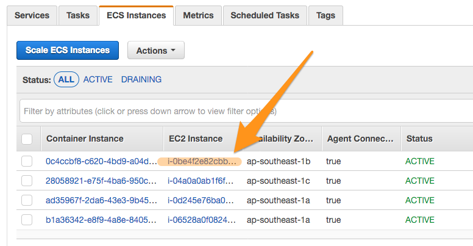
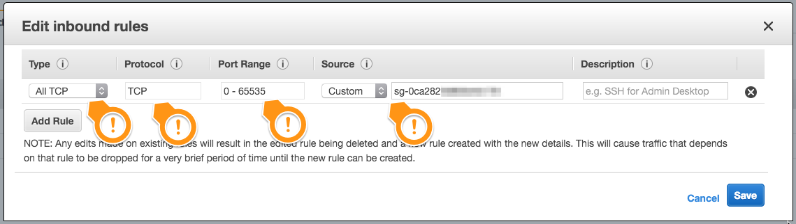

Module 04: Load Balancing
===

While it's very useful to be able to scale the number of containers in your
cluster, that's only really useful if your containers are sending out requests
themselves. When other entities need to talk to your containers 
(e.g. if your containers are API endpoints, or the fronted web server of an app),
it's not very convenient to have each container accessible only through their
IP address. Furthermore, since containers are mortal, whenever one needs to be
replaced, the IP address will also change as a result.

To solve this problem, we normally place containers behind some form of a 
[**load balancer**](https://en.wikipedia.org/wiki/Load_balancing_(computing)).

## Architecture Overview

Amazon ECS supports launching containers behind load balancers.
In this module, we'll use an **Application Load Balancer** to automatically
route incoming connections to a fleet of containers running in an Amazon
ECS service.

---

## Implementation Details

### 1. Create an Application Load Balancer

An [Application Load Balancer](https://docs.aws.amazon.com/elasticloadbalancing/latest/application/introduction.html) (ALB) is a load balancer that operates at the application layer
(or Layer 7 of the [OSI model](https://en.wikipedia.org/wiki/OSI_model)).

ALBs operate in front of a collection of possible destinations (called targets).
This collection is formally called a Target Group. Anything that is inside a 
target group (that is considered healthy) is a valid target for an ALB to 
delegate network traffic to.

#### High-level instructions

Create an ALB from the Amazon EC2 dashboard, as well as the corresponding
target group. Ensure that the target group is empty, and that the target group
type is **instance**.

  
<strong>Step-by-step instructions (click to expand):</strong>

  

  
  1. Go to your [Amazon EC2](https://console.aws.amazon.com/ec2) dashboard.
     From the left navbar, navigate to your **Target Groups**.
  2. Create a new target group, then specify the following options:
     - **Target group name**: _<< your choice >>_ (`nickname-ecs-tg` is good)
     - **Target type**: Instance
     - **Port**: `8080` 
     - **VPC**: _Select the VPC you configured for this workshop._
     - Under **Advanced health check settings**:
       - **Healthy threshold**: `3`
       - **Interval**: `6`
  3. Click **Create**. Note that this target group does **not** have any targets yet.
  4. After creating your target group, go to **Load Balancers** on the left navbar,
     and create a new load balancer.
  5. Opt for an **Application Load Balancer**.
  6. In the next screen, plug in these values:
     - **Name**: _<< your choice >>_ (`nickname-ecs-alb` is good)
     - **VPC**: Make sure the VPC you prepared for this workshop is selected.
       - Also, ensure you've checked all three availability zones.
     - Click **Next**.
  7. Ignore the warning on **Step 2** for now.
  8. When prompted, choose to **Create a new security group**, and make sure to 
     give it a proper name (`nickname-ecs-alb-sg` is great).

     Note that there should already be a rule allowing `TCP` on port `80` from
     a custom source `0.0.0.0/0, ::/0`. 

     > **NOTE:**
     > 
     > `0.0.0.0/0, ::/0` essentially means "anywhere".

     Click **Next**.
  9. For **Target Group**, select the target group you just created. Click **Next**.
  10. Ignore the step for registering targets. We want to keep this target group
      empty for now. Click **Next**.
  11. If you're satisfied with the configuration details in the review screen,
      click **Create** to complete the creation of the ALB.
  

Your ALB will take a moment to complete provisioning. That's OK --- since there
are no targets behind it yet, it doesn't really do anything.

Before we move on to the next step, however, make sure you copy the
**DNS name** of the ALB you just created. This is the URL you can use to 
communicate with the ALB (and consequently talk to the containers eventually
behind it).

### 2. Create a new task definition that uses our ALB

In Amazon ECS, the service definition specifies the networking requirements of
the containers we're running --- including information on whether or not a
load balancer should be used.

Once services are created, the load balancing configuration cannot be
changed anymore, so we will need to create a service.

#### High-level instructions

Create a new Amazon ECS task definition with the same configuration as our 
current one, but instead uses the ALB we just created.

  
<strong>Step-by-step instructions (click to expand):</strong>

  

  
  1. Go to your Amazon ECS **Clusters** dashboard, and opt to create a new service.
  2. Again, set the launch type to **EC2**, and select the latest revision
     of our task definition. (This should now be revision 3, with the 
     dynamic port mapping.)

     Give the service a name (`nickname-ecs-app-alb` is good), then set the other
     options as you did before. Specify a task number of 3.
  3. On the **Configure Network** step, under **Load balancing**, opt to use
     an **Application Load Balancer**. 

     Set the **Service IAM role** to `Create new role`, and make sure you select
     the ALB you created.
  4. Under **Container to load balancer**, select your container (there should
     only be one option here now --- it will look like `app:0:8080`), then
     click **Add to load balancer**.

     In the options list that appears, put in the following values:
     - **Production listener port**: `80:HTTP`
     - **Target group name**: _Select the target group you created_

     The rest of the section should have been pre-filled with the values
     you set when you created your ALB and target group.

     Click **Next step**.
  5. Ignore the step for **Auto Scaling** for now. Click **Next step**.
  6. If you're satisfied with the settings, click **Create Service**.
  

Again, your service will take a few moments to completely provision, but once it
finishes (check your service's **Tasks** tab!) the tasks will have been launched 
behind your ALB. Confirm that you can reach your containers by accessing the 
ALB's DNS name using your browser.

If you keep refreshing your browser, you should get different containers as you
refresh. This shows you that the incoming network connections are being delegated
to the different targets behind your load balancer.

### 3. Clean up our old service

We don't need our old service anymore. We now have an improved version of it
behind a load balancer. Just makes sense we remove our old service so that
we can save on costs, and free up valuable resources.

#### High-level instructions

Make the old service go 💥**BOOM**💥.

  
<strong>Step-by-step instructions (click to expand):</strong>

  

  
  1. Select your old service in your Amazon ECS cluster, and choose to update it.
     Under **Number of tasks**, bring this down to `0`. Skip to review, and 
     confirm the update.
  2. Your service will now attempt to kill tasks to bring your task count to `0`.
     Once there are no more tasks running under this service, you can go to your 
     cluster's **Services** tab, and safely delete the service.
  

Deleting a service in this way (by specifying for it to reduce its tasks to `0`),
is a relatively safe way to decommission a service. The service is responsible
for deleting the tasks under it, as well as other resources that the tasks may
be using. 

### 4. Improve our ECS cluster security grouping

Right now, our ECS cluster is not quite secure --- in the last module, we 
opened up all our ECS instances to all TCP traffic from anywhere. This is 
far from ideal.

The recommended architecture is to only allow the necessary traffic into your 
instances.

Considering this, we'll modify our ECS cluster to only allow incoming TCP
traffic from our load balancer. This prevents anyone from directly accessing 
our containers --- any traffic going into them (e.g. a browser), will need to
go through the load balancer.

#### High-level instructions

Modify the security group of your ECS instances to only allow incoming `TCP`
traffic across all ports from the security group assigned to your ALB.

  
<strong>Step-by-step instructions (click to expand):</strong>

  

  
  1. Go to your [Amazon EC2](https://console.aws.amazon.com/ec2) dashboard,
     and navigate to your **Load Balancers**.
  2. Select the ALB you created, and take note of the security group assigned
     to it, located towards the bottom of its **Description** tab.
  3. Back in your cluster dashboard, check the **ECS Instances** tab, and 
     click one of the EC2 Instance IDs listed. 

     
  4. This will take you again to your EC2 dashboard, with that EC2 instance 
     selected. Below in its **Description** tab, click on the **Security group**
     assigned to it.
     > **NOTE:**
     >
     > All the EC2 instances that make up your EC2 cluster will have the
     > same security group, because they are launched under an auto-scaling
     > group managed by Amazon ECS.
     > 
     > This means that changing this security group will affect all the EC2
     > instances that are members of your Amazon ECS cluster.
  5. In the screen you are sent to, select the **Inbound** tab at the bottom,
     and click **Edit**.
  6. Remove the rules currently assigned to this security group.
     Add a new rule with the following values:
     - **Type**: All TCP
     - **Source**: Custom
       - Type in the security group ID of your ALB (see step 2 above).
     Click **Save** when you're satisfied.

     
  

After you've modified the security group, confirm that you can still talk
to your containers using the ALB DNS name.

Afterwards, navigate to one of your task's detail page, and try to access it
using its external URL --- confirm that you cannot anymore.

---

## Summary

