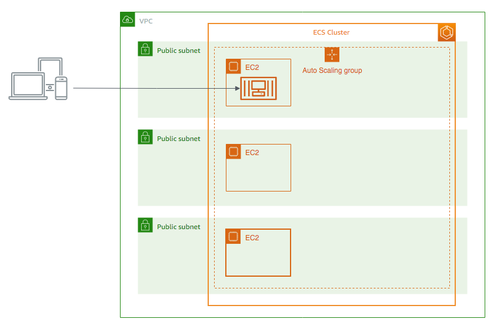
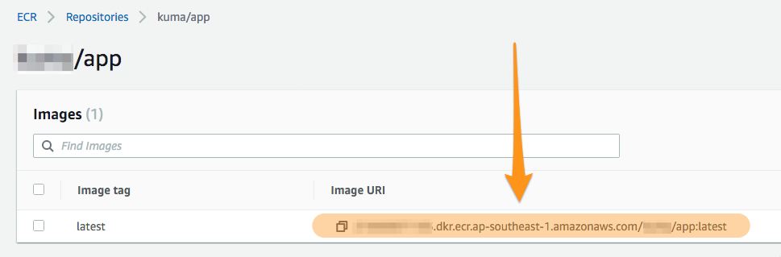
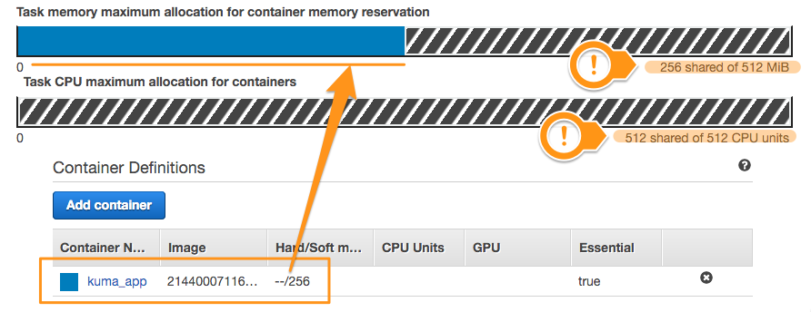
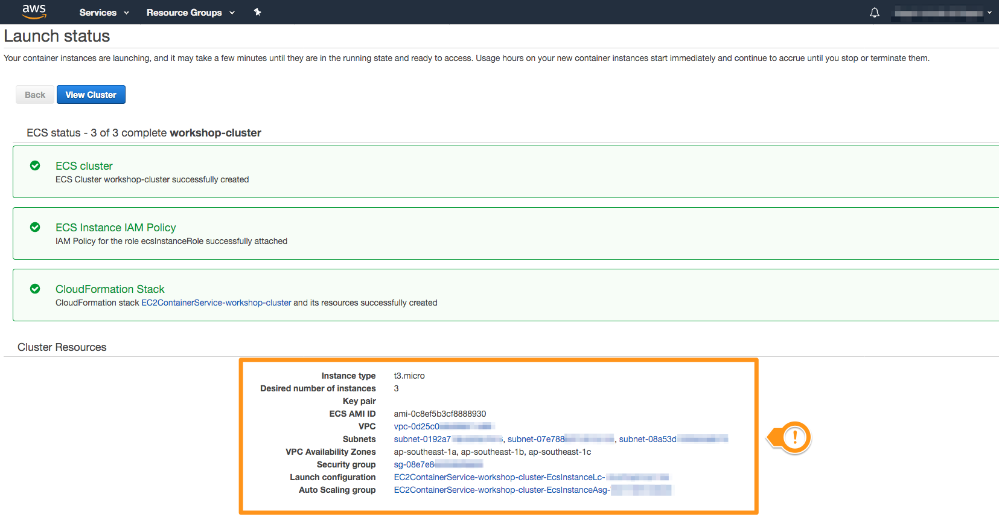
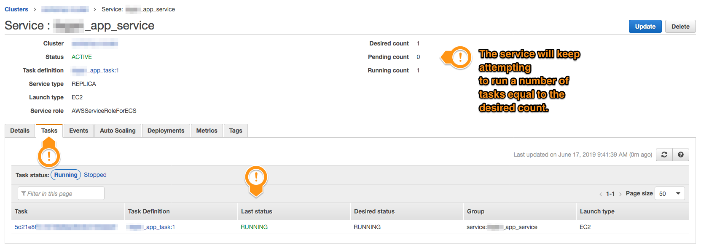
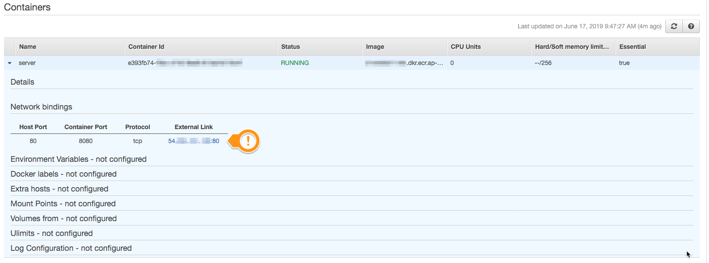

Module 02: Deploying an Amazon ECS cluster
===

In this module, we'll create an [Amazon ECS](https://aws.amazon.com/ecs)
cluster, and use it to run the docker image we created in the last module.

## Architecture Overview

Docker containers need to run on a host machine (just like how a virtual machine
needs to run in a real host machine). An Amazon ECS cluster is a collection
of [Amazon EC2](https://aws.amazon.com/ec2) instances that are meant to run
your docker containers.

Amazon ECS is a form of **orchestrator**. 
A simple way of thinking about it is, you can tell Amazon ECS how many containers
you want to run, and it will take care of creating those containers,
distributing them across all your available hosts, and ensuring that you maintain
that many containers as best it can. This means that if a container becomes
unhealthy for some reason, Amazon ECS takes care of replacing it so that your
application can keep on running.

In this module, we'll create an Amazon ECS cluster that has 3 host EC2 instances,
distributed across 3 different availability zones (AZs).

We'll then use this cluster to run multiple copies of the docker image we
created in the last module.

---

## Implementation Details

### 1. Create an image repository on Amazon ECR

If docker containers need to run on a host machine, docker images, on the other
hand, need to be stored in an image repository. A popular image repository
is the [Docker Hub](https://hub.docker.com) where publicly available images
(like the `node` base image you used last module) are distributed.

[Amazon ECR](https://aws.amazon.com/ecr) is an image repository that you can
use to privately, securely, and durably store your docker images for use
in your own applications and workloads.

#### High-level instructions

Create an Amazon ECR repository for the image you created, and push the `:latest`
version of it into it.

  
<strong>Step-by-step instructions (click to expand)</strong>

  

  
  1. Go to the [Amazon ECR](https://console.aws.amazon.com/ecr) service on
     your console, and create a new repository.
  2. Give your repository a name unique to the image. The image name you used
     in the last module (e.g. `my-app/server`) is a good choice.
  3. Back in the repositories list, click your new repository. 
     Click the **View push commands** button at the top, and follow the 
     instructions to push your docker image to the repository you created.
  

---

### 2. Create a task definition for your image

In Amazon ECS, containers run in a construct called a **task**. 
A task contains one or more containers, grouped together and designed to run
as a single unit.

> **NOTE:** 
> 
> If you're familiar with [Kubernetes](https://kubernetes.io), 
> Amazon ECS tasks are similar to Kubernetes pods.
>
> You can also [use Kubernetes as an orchestrator on AWS](https://aws.amazon.com/eks).

To run a task, you will need to create a **task definition**.
This contains all the information needed for Amazon ECS to run your containers
in the right configuration whenever it needs to.

#### High-level instructions

Create a task definition that launches your docker image in ECS mode.
The task definition should only run your docker image, and map the host port `8080`
to the container port `8080`.

  
<strong>Step-by-step instructions (click to expand):</strong>

  

  
  1. Navigate to the [Amazon ECS](https://console.aws.amazon.com/ecs) service
     on your console, and select **Task Definitions** on the left navbar.
  2. Create a new Task Definition. We will configure this Task Definition to run
     containers autonomously, with a public IPv4 address for each.
  3. Select the **EC2 launch type** when prompted.
  4. Provide the following values for configuration options:
     - **Task Definition Name**: _<< your choice >>_ (`nickname_app_service` is good)
     - **Task Role**: None
     - **Task Execution Role**: Create new role
     - **Task memory**: 512
     - **Task CPU**: 512
     > **NOTE:** 
     > 
     > Containers can be set to run and be limited by fractional CPU units,
     > unlike traditional VMs. `1024` CPU units is equivalent to `1 vCPU`. 
     > Setting a value of `512` CPU units is saying that you're limiting this
     > task to only half a virtual CPU core.
  5. Under **Container Definitions**, click **Add container**.
     Container Definitions list all the containers that will need to run whenever
     this task is initiated.
     - **Container name**: _<< your choice >>_ (`nickname_imagename` is good)
     - **Image**: _the image URI from Amazon ECR_
       
     - **Memory Limits**: 256 __soft limit__
     - **Port mappings**: `80` host port / `8080` container port / `tcp`
     > **NOTE:**
     > 
     > Notice how your container is reserving resources allocated for this task.
     > Each task is allocated some resources (as defined by your task definition),
     > and each container running in the task can reserve some of those resources
     > in turn. The total resource consumption of all containers in a task
     > cannot exceed the total resources available for the task.
     > 
     - Click **Add** to complete this container configuration.
  6. Click **Create**. We will skip the other options for now.
  

When you now go back to your Task Definitions dashboard, you should see your 
new task with a **Latest Revision Status** set as `ACTIVE`.

If you click through your task, it should only list one revision. 

---

### 3. Create an ECS cluster

Now that we have a task definition to run containers, we'll need a cluster
to actually run our containers in.

#### High-level instructions

Create an ECS cluster with 3 `t3.micro` EC2 hosts, segregated across 
3 different Availability Zones (AZs).

  
<strong>Step-by-step instructions (click to expand):</strong>

  

  
  1. Still on your [Amazon ECS dashboard](https://console.aws.amazon.com/ecs), 
     click the **Clusters** link on the left navbar.
  2. Click **Create Cluster** at the top. Select **EC2 Linux + Networking**
     when given the option. This will launch the cluster using EC2 instances
     you manage and provision yourself.
  3. Provide the following inputs:
     - **Cluster name**: _<< your choice >>_ (`nickname_ecs_cluster` is great)
     - **Provisioning model**: On-Demand Instance
     - **EC2 instance type**: `t3.micro`
     - **Number of instances**: 3
     - **EC2 AMI ID**: Amazon Linux 2 AMI
  4. Under **Networking**, provide the following inputs:
     - **VPC**: _select the VPC you prepared for this workshop_. 
       (If you don't recognize which it is, you may want to go to your
       [VPC dashboard](https://console.aws.amazon.com/vpc) to review.)
     - **Subnets**: select all (3) subnets you want to deploy EC2 instances to.
       You will need to keep clicking the dropdown to select subnets one at a time.
     - **Security group**: Create a new security group
     - **Security group inbound rules**: Keep the defaults:
       - `0.0.0.0/0` CIDR
       - `80` Port range
       - `tcp` protocol
  5. Under **Container instance IAM role**, select `ecsInstanceRole`.
     If it is not available, opt to `Create a new role`.
  6. Click **Create** to complete cluster creation.
  

Amazon ECS will take a few moments to create your cluster.
An [Amazon CloudFormation](https://aws.amazon.com/cloudformation) template will 
be created and synthesized for you, and this will be used to deploy your
cluster across your account.

Once the cluster creation is done, you'll have a bunch of information about the
cluster ready. While not required, you may want to copy out the resource values
somewhere accessible. 

> **NOTE:** 
> 
> You can always find these values in your dashboard --- 
> it might just be a bit easier if you already have the values on hand.

Confirm that your cluster has the following:
- 3 `t3.micro` instances, across 3 subnets and 3 AZs
- a security group

---

### 4. Run containers on your ECS cluster 🚀

Alright! We've got a docker image, we've got a task defined to run it, 
we've got a cluster to run our containers, **and** we've got a coffee!
(Get one if you don't have one, maybe.)

Let's get to actually running stuff.

#### High-level instructions

Run a single instance of the task you created in your ECS cluster.
Verify that you can reach the container.

  
<strong>Step-by-step instructions (click to expand):</strong>

  

  
  1. Go to your clusters dashboard, and click through to your cluster detail page.
     You should see that:
     - It has an `ACTIVE` status.
     - It has 3 **registered EC2 container instances**.
     - Zero services and tasks are running. 
  2. On the **Services** tab of your cluster, click **Create** to start 
     initializing a new service.
     > **IMPORTANT:**
     >  
     > An ECS service is a logical collection of tasks (containers) that run
     > as a unit. If a container dies within a service, the service is responsible
     > for replacing it to keep the service running.
     > 
     > If you're accustomed to building applications 
     > [in layers](https://en.wikipedia.org/wiki/Multitier_architecture),
     > you might find it convenient to think of ECS services as a layer in
     > your application architecture (e.g. the web server layer, or logic layer).
     >
     > If you're already familiar with [Kubernetes](https://kubernetes.io), 
     > an ECS service is very similar in concept to a 
     > [Kubernetes Service](https://kubernetes.io/docs/concepts/services-networking/service/).
  3. Select the following options:
     - **Launch type**: EC2 (we'll get to [Fargate](https://aws.amazon.com/fargate) later!)
     - **Task Definition**: Select the task definition you just created, with the
       latest revision selected (you should probably only have one at this point).
     - **Cluster**: Select the ECS cluster you created.
     - **Service Name**: Give your service a name. (`nickname_app_service` is great)
     - **Service Type**: Replica
     - **Number of Task**: 1
     - **Task Placement**: AZ Balanced Spread
     - Click **Next Step**
  4. Under **Configure Network**, input the following configuration values:
     - **Load Balancing**: None
     - Click **Next Step**
  5. Under **Set Auto Scaling**, select **Do not adjust the service's desired count**.
  6. Confirm your service details, then click **Create Service**.
  

It should only take a very short while for your service to be created.
Click **View Service** to go to the service's detail page.

Your ECS service will attempt to launch a number of tasks equal to the desired 
number you specified (should be only 1 at this point), using the task definition
you provided. 

The service detail page will list all the tasks it's currently running,
and each will go from `ACTIVATING` to `RUNNING` if you've configured your service
and tasks correctly. 

Click the **Task ID** to go to that task's detail page.

On the task detail page, you can review a lot of information about the task,
including which cluster it's running in, what its status is, and the containers
it's currently running.

Under the **Containers** section, if you expand the row of the container it's running
(there should only be one now), you can also see quick details about the container
itself. Most important right now is that it **should have been given an external
link**. 

Open the external link on another browser tab. 
If everything is working correctly, you should be able to see the message from
your container (`Hello from {CONTAINER ID}!`).

---

## Summary

Congratulations! You've completed what is probably the most difficult part
of this workshop. You've created a Docker image repository in
[Amazon ECR](https://aws.amazon.com/ecr) and pushed a Docker image into it,
created an [Amazon ECS](https://aws.amazon.com/ecs) cluster, and also
created a task definition to run your Docker image. 
Finally, you ran that task in your ECS cluster using a service.

So, just a recap of the stuff you've created:

- Docker images need to be pushed into a registry to be shared.
  You created a registry using [Amazon ECR](https://aws.amazon.com/ecr).

- Tasks definitions contain information on what containers need to be run together,
  and the resources they require, among other things. 
  In [Amazon ECS](https://aws.amazon.com/ecs), containers run inside tasks.

- Clusters are a collection of hosts machines that can run your containers. 
  When containers need to be run, the orchestrator decides which host in your
  cluster to run your container in. 

- Services run and maintain a number of tasks that your application requires.
  The number of tasks required can be dictated manually (like we just did),
  or determined automatically using other means (e.g. autoscaling).

In the next module, we'll use the infrastructure you just built to explore
a few more things that we can do with containers and 
[Amazon ECS](https://aws.amazon.com/ecs).
