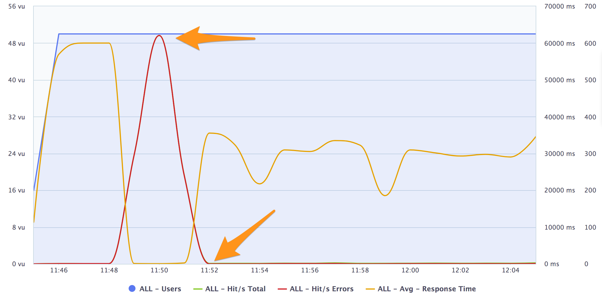

Module 06: Auto-scaling Tasks
===

One of the biggest advantages of using containers is that
you're able to start containers very rapidly. This allows you
to do some very creative things not normally possible with
on-premise deployments, or sometimes even with traditional cloud.

In this module, we'll look into automatically scaling our
Fargate service, so that as more users use our service, more 
containers are automatically created to handle the increased load.

> **IMPORTANT:**
>
> To properly do auto-scaling, you should have successfully done
> the creation of a Fargate-enabled load balancer setup from the previous
> module's objectives.

---

## Implementation Details

### 1. Add a heavy computation to your Docker image.

Let's artificially introduce a heavy computation in our application.

<details>
   <summary><strong>Step-by-step instructions (click to expand):</strong></summary>
   <p>
   
   1. Back in the source code for your app, let's install a few additional
      dependencies:

      ```
      npm install --save --save-exact threads
      ```
   2. Change the source code of your app to introduce a new endpoint:
      ```javascript
      const { spawn } = require('threads')
      const express = require('express')
      const app = express()

      const HOSTNAME = process.env.HOSTNAME || 'unnamed'
      const PORT = process.env.PORT || 8080

      // :: ---

      app.get('/', (request, response) => {
      response.send(`Hello from ${HOSTNAME}!`)
      })

      // :: ---

      const computation = () => {
      const thread = spawn((input, done) => {
         const limit = 5e4
         let lasthash = ''

         for (let i = 0; i < limit; i++) {
            lasthash = require('crypto')
            .createHash('md5')
            .update(lasthash + new Date())
            .digest('hex')
         }

         done(lasthash)
      })

      return new Promise((resolve, reject) => {
         thread.on('message', (response) => {
            resolve(response)
            thread.kill()
         })

         thread.on('exit', () => console.log('Worker terminated.'))
         thread.send()
      })
      }

      app.get('/computation', async (request, response) => {
      const result = await computation()
      response.send(result)
      })

      app.listen(PORT, () => console.log(`Example app running on port ${PORT}.`))
      ```
   3. Build your image again.
      ```
      docker build -t <your-namespace>/<your-image-name> .
      ```
   4. Confirm that the endpoint works by running the image on your local
      and visiting `localhost:8080/computation`.
      ```
      docker run -it --rm -p 8080:8080 <your-namespace>/<your-image-name>
      ```
   5. Follow the instructions in [Amazon ECR](https://console.aws.amazon.com/ecr)
      to push your new image back up to your repository.
   6. Update your Fargate service and task definition to use your new image.
   </p>
</details>

### 2. Add an auto-scaling policy to your service.

<details>
   <summary><strong>Step-by-step instructions (click to expand):</strong></summary>
   <p>
   
   1. Navigate to your Fargate service's detail page, and click **Update**.
   2. Skip over to **Step 3** to start configuring auto-scaling.
   3. Opt to **Configure Service Auto Scaling**, and put in the following:
      - **Minimum number of tasks**: 2
      - **Maximum number of tasks**: 20
      - **IAM Role**: Create new Role
   4. Click **Add Scaling Policy**, and input the following values:
      - **Scaling policy type**: Target tracking
      - **Policy name**: _<< your choice >>_ (`nickname-fargate-service-asp` is good)
      - **ECS Service Metric**: `ECSServiceAverageCPUUtilization`
      - **Target value**: `50`
      - **Scale-out cooldown period**: `30`
      - **Scale-in cooldown period**: `30`
      - Click **Next**.
   5. Confirm your changes then click **Update**.
   </p>
</details>

After updating your service, confirm that you can still visit your service
through your ALB.


### 3. Bombard your service and wait for it to scale.

If you have a preference on a load testing tool, use that.
Otherwise, [Blazemeter](https://blazemeter.com) has a free tier you can use.

<details>
   <summary><strong>Step-by-step instructions (click to expand):</strong></summary>
   <p>
   
   1. Set up your load test so that you are sending requests to your
      `/computation` path, through your ALB.
      (e.g. `https://my-load-balancer.amazon.com/computation`)
   2. Send as many requests over as many users as you want.
      If you're using Blazemeter, set it up so that you're sending requests
      from **50 users** over **20 minutes** with **5 minute ramp up time**.
   3. Look at the pretty graphs.
   4. Check out the events happening in your Fargate service. 
      Eventually your service is going to start getting congested, and the
      ECS service will orchestrate a scaling, and add more tasks automatically.
   </p>
</details>

If configured correctly, your Fargate service should have automatically
scaled the number of tasks in your service to address the increasing demand.

This should be visible in the graph.


